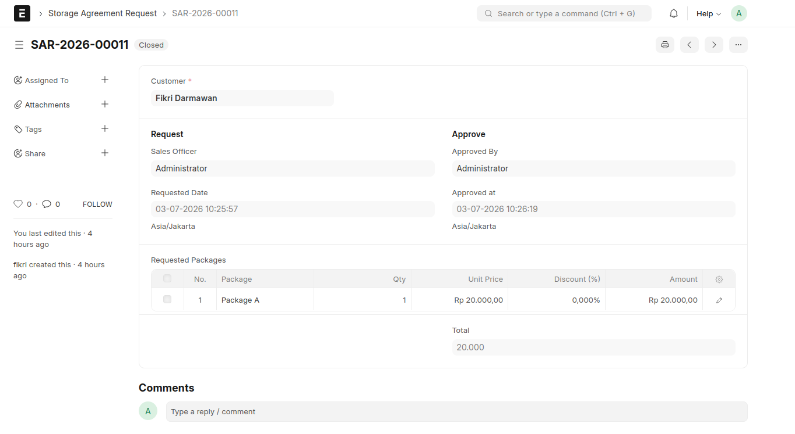
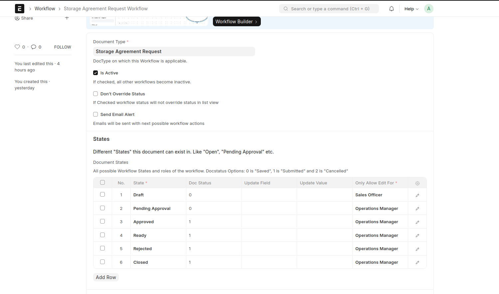
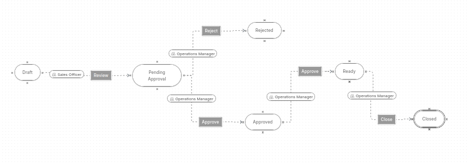
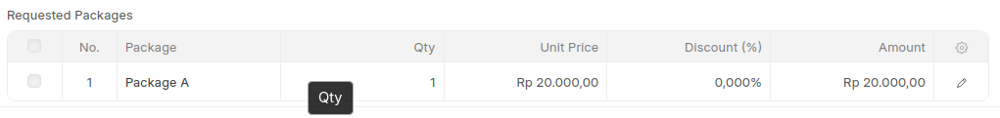
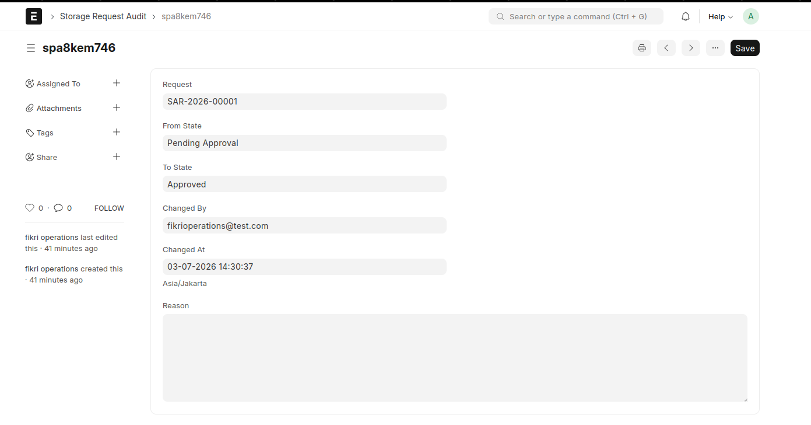
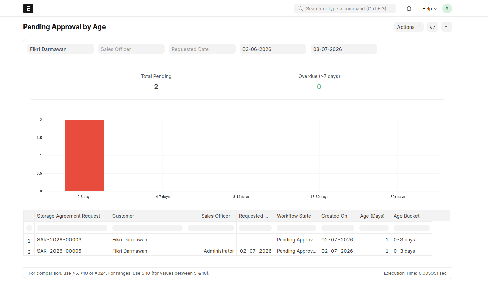

# CryoCord Onboarding Assessment

Custom ERPNext application developed for the CryoCord ERP/Frappe Assessment.

The application implements a **Storage Agreement Request** approval process with role-based workflow, server-side validations, audit trail, REST API, and reporting while following a **Modular Monolith** architecture with **Clean Architecture** principles.

---

# Tech Stack

- Frappe Framework
- ERPNext
- Python
- MariaDB
- JavaScript

---

# Requirements

- Ubuntu 22.04+ (Recommended)
- Frappe Bench
- ERPNext
- Python 3.11+
- NodeJS (Supported by your Frappe version)

---

# Installation

Clone the application into your bench.

```bash
cd frappe-bench/apps

git clone https://github.com/pikjung/cryocord_onboarding.git
```

Install the app.

```bash
cd ~/frappe-bench

bench --site <your-site> install-app cryocord_onboarding
```

Run migration.

```bash
bench --site <your-site> migrate
```

Build assets.

```bash
bench build
```

Restart bench.

```bash
bench restart
```

---

# ERPNext Dependency

This application depends on **ERPNext**.

Please ensure ERPNext has already been installed before installing this application.

Example:

```bash
bench get-app erpnext
bench --site <site-name> install-app erpnext
```

---

# Features

## 1. Storage Agreement Request



Main transaction document used by Sales Officer to submit a storage request.

Features:

- Customer reference
- Lead reference
- Opportunity reference
- Workflow approval
- Requested Packages
- Server-side validation
- Automatic amount calculation
- Automatic total calculation

### Workflow




```

Draft
|
| sales Officer
|
Pending Approval
|
| Operations Manager
|
├── Approved
|   ├── Ready
|   └── Closed
└── Rejected

```

---

## 2. Storage Agreement Item



Child Table of Storage Agreement Request.

Automatically calculates:

```

Amount = Qty × Unit Price
Amount = Amount - Discount (%)

```

Parent document automatically calculates:

```

Total = SUM(Item Amount)

```

---

## 3. Storage Request Audit


Custom audit log used to record every workflow transition.

Each workflow transition creates a new immutable audit record containing:

- Storage Request
- Previous Status
- New Status
- Changed By
- Changed At

This audit trail is append-only and independent from ERPNext Version history.

---

# Permission

Two primary business roles are implemented.

## Sales Officer

Can

- Create Request
- Edit Draft
- Submit Request

Cannot

- Approve
- Reject

---

## Operations Manager

Can

- View Pending Requests
- Approve
- Reject
- Modify Draft
- Report

Additional server-side validation prevents users from approving their own requests.

---

# Server Side Validation

Business rules are validated on the server to prevent API bypass.

Examples:

- Creator cannot approve own request
- Request must contain at least one package
- Rejected request requires rejection reason
- Amount calculation validation
- Workflow transition validation

---

# Audit Trail

Every workflow transition generates a new Storage Request Audit record.

Example

| From             | To               | User               |
| ---------------- | ---------------- | ------------------ |
| Draft            | Pending Approval | Sales Officer      |
| Pending Approval | Approved         | Operations Manager |

---

# REST API

Retrieve pending approval requests.

The endpoint requires an authenticated ERPNext user with sufficient permission.

Guest access is disabled.

Endpoint

```

GET /api/method/get_pending_approval_requests

```

Python Path

```

cryocord_onboarding.crm.controller.api.api.get_pending_approval_requests

```

Example Response

```json
{
  "message": [
    {
      "name": "SAR-2026-00005",
      "sales_officer": "Administrator",
      "requested_date": "2026-07-02 17:02:06.770620",
      "workflow_state": "Pending Approval",
      "creation": "2026-07-02 17:01:57.456490"
    }
  ]
}
```

---

# Report

## Pending Approval by Age



Displays all pending requests ordered by waiting duration.

Columns

- Request
- Customer
- Sales Officer
- Requested Date
- Workflow State
- Created on
- Age (Days)
- Age Bucket

Purpose

Allows Operations Manager to prioritize the oldest approval requests.

---

# Project Structure

```

cryocord_onboarding/
│
├── cryocord_onboarding/
|   |
|   ├── doctype/
|   │   ├── storage_agreement_request/
|   │   ├── storage_agreement_item/
|   │   └── storage_request_audit/
|   │
|   └── report/
|       └── pending_approval_by_age/
|
├── crm/
|   │
|   ├── controller/
|   │   ├── api/
|   |   └── events/
|   |
|   ├── services/
|   └── repository/
│
├── hooks.py
│
└── modules.txt

```

---

# Architecture

This project follows a **Modular Monolith** architecture.

Business logic is separated into modules to improve maintainability while remaining inside a single Frappe application.

```

Presentation Layer
(JS / API)

↓

Controller Layer

↓

Service Layer

↓

Repository Layer

↓

Frappe ORM

```

Business rules are isolated inside the Service layer.

Database access is handled by the Repository layer.

Controllers act only as orchestration.

This approach keeps the application testable, maintainable, and easier to extend.

---

# Design Decisions

## Reuse ERPNext Master Data

Instead of creating a custom customer entity, the application reuses ERPNext's standard **Customer** DocType.

Benefits

- Avoid duplicated master data
- Native ERPNext integration
- Upgrade-safe customization

---

## Server-side Validation

Critical business rules are implemented in Python rather than JavaScript.

Reasons

- Prevent REST API bypass
- Prevent data manipulation
- Maintain data integrity

---

## Custom Audit Trail

ERPNext Version records document changes but is not designed to capture approval history.

A dedicated **Storage Request Audit** DocType provides a complete approval history.

---

## Upgrade Safe

The application does not modify ERPNext core files.

All customizations are implemented inside the custom application to ensure compatibility with future ERPNext upgrades.

# Design Rationale

## Why Customer?

Customer reuses the standard ERPNext master data to avoid duplication and leverage existing ERPNext features such as Contact, Address, Sales Order, and future integrations.

---

## Why Child Table?

Requested Packages exist only within a Storage Agreement Request and do not have an independent lifecycle.

Therefore, a Child Table is more appropriate than a standalone DocType.

---

## Why Custom Audit?

ERPNext Version records field changes but does not explicitly capture approval transitions.

A dedicated Storage Request Audit provides immutable business-level audit history.

---

## Why Server-side Validation?

Business rules are implemented in Python to prevent bypass through REST API, background jobs, or direct database manipulation.

---

# Production Readiness

This assessment focuses on the core business requirements.

For production deployment, several improvements are recommended:

- Unit and integration tests
- Email notifications for approval workflow
- SLA monitoring for pending approvals
- Workflow notifications
- Background jobs for asynchronous processing
- Role-based dashboard
- API rate limiting
- Enhanced logging and monitoring
- CI/CD pipeline
- Docker deployment
